# ensf400-lab9-jenkins

This lab shows you how to use Jenkins to orchestrate building a simple Python application with [PyInstaller](https://www.pyinstaller.org/).

The simple Python application (which you’ll obtain from a sample repository on GitHub) is a command line tool "add2vals" that outputs the addition of two values. If at least one of the values is a string, "add2vals" treats both values as a string and instead concatenates the values. The "add2" function in the "calc" library (which "add2vals" imports) is accompanied by a set of unit tests. These are tested with pytest to check that this function works as expected and the results are saved to a JUnit XML report.

The delivery of the "add2vals" tool through PyInstaller converts this tool into a standalone executable file for Linux, which you can download through Jenkins and execute at the command line on Linux machines without Python.

## Prerequisites

This lab will be performed in [GitHub CodeSpaces](https://github.com/codespaces). Create an instance using GitHub Codespaces. Choose repository `denoslab/ensf400-lab9-jenkins`.

## Run Jenkins in Docker Compose

In this tutorial, you’ll be running Jenkins as Docker container customized from the base image [`jenkins/jenkins:alpine`](https://hub.docker.com/r/jenkins/jenkins) Docker image.

Run the following command to boot up Jenkins using Docker Compose:

```bash
$ docker compose up -d
```
The image will automatically be built, which is to install Docker on the Jenkins Alpine base image.

Note that after Jenkins is up and running in the container, there will be a port `8080` automatically forwarded for external access. 


## Accessing the Jenkins Docker container

You may access the Jenkins container (through a separate terminal/command prompt window) with a `docker exec` command like:

```bash
$ docker compose exec -it jenkins bash
8122ba5d44f1:/# exit
exit
```

## Unlocking Jenkins

When you first access a new Jenkins instance, you are asked to unlock it using an automatically-generated password.

Browse the mapped URL, for instance, `https://shiny-acorn-r74pgq4g552p76g.github.dev/` (the URL will be different on your Codespaces instance)

<p align='center'>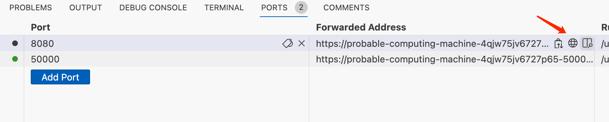</img></p>

Wait until the `Unlock Jenkins` page appears.

<p align='center'>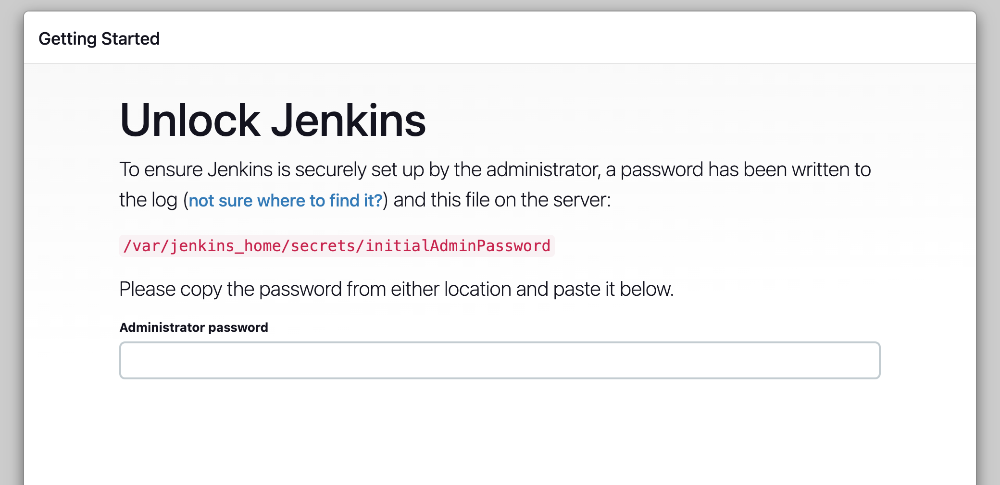</img></p>

From your terminal/command prompt window again, use the following command to output Jenkins logs:

```bash
$ docker compose logs jenkins
```
Copy the automatically-generated alphanumeric password (between the 2 sets of asterisks).

<p align='center'>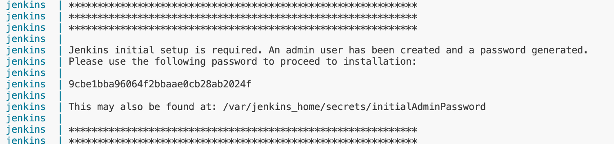</img></p>

On the `Unlock Jenkins` page, paste this password into the `Administrator password` field and click `Continue`.


## Customizing Jenkins with plugins

After unlocking Jenkins, the `Customize Jenkins` page appears.

On this page, click `Install Suggested Plugins`.

<p align='center'>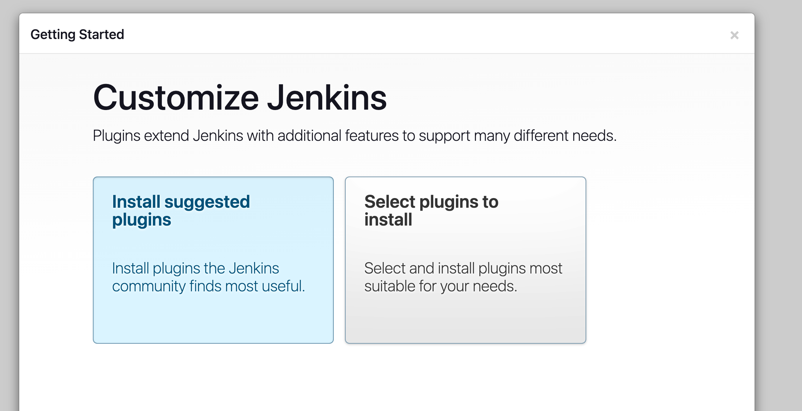</img></p>

The setup wizard shows the progression of Jenkins being configured and the suggested plugins being installed. This process may take a few minutes.

## Creating the first administrator user

Finally, Jenkins asks you to create your first administrator user.

1. When the `Create First Admin User` page appears, specify your details in the respective fields and click `Save and Continue`, `Save and Finish`.
1. When the `Jenkins is ready!` page appears, click `Start using Jenkins`.
1. If required, log in to Jenkins with the credentials of the user you just created and you’re ready to start using Jenkins!

**IMPORTANT:** Install `Docker Pipeline` plugin:
`Dashboard -> Manage Jenkins -> Plugins -> Available Plugins -> Docker Pipeline`

<p align='center'>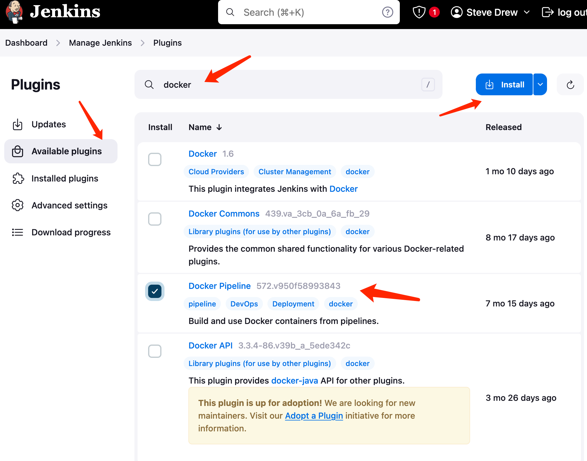</img></p>

## Stopping and restarting Jenkins

Ater installing `Docker Pipeline` plugin, we MUST  restart the Jenkins:

1. Run the following command:
    ```bash
    $ docker compose restart jenkins
    ```
2. Refresh the web page using the port forwarding URL, for instance, `https://shiny-acorn-r74pgq4g552p76g.github.dev/` (the URL will be different on your Codespaces instance).
3. Log into the system using the username and password you just configured.

## Fork and clone the sample repository on GitHub

Obtain the simple "add" Python application from GitHub, by forking the sample repository of the application’s source code into your own GitHub account and then cloning this fork locally.

1. Ensure you are signed in to your GitHub account. If you don’t yet have a GitHub account, sign up for a free one on the [GitHub website](https://github.com/).

1. Fork the [`simple-python-pyinstaller-app`](https://github.com/jenkins-docs/simple-python-pyinstaller-app) on GitHub into your local GitHub account. If you need help with this process, refer to the [Fork A Repo](https://help.github.com/articles/fork-a-repo/) documentation on the GitHub website for more information.

1. Clone your forked `simple-python-pyinstaller-app` repository (on GitHub) locally to your machine. 

## Create your initial Pipeline as a Jenkinsfile

You’re now ready to create your Pipeline that will automate building your Python application with PyInstaller in Jenkins. Your Pipeline will be created as a `Jenkinsfile`, which will be committed to your locally cloned Git repository (`simple-python-pyinstaller-app`).

This is the foundation of "Pipeline-as-Code", which treats the continuous delivery pipeline a part of the application to be versioned and reviewed like any other code. Read more about Pipeline and what a Jenkinsfile is in the [Pipeline](https://jenkins.io/doc/book/pipeline) and [Using a Jenkinsfile](https://jenkins.io/doc/book/pipeline/jenkinsfile) sections of the User Handbook.

First, create an initial Pipeline with a "Build" stage that executes the first part of the entire production process for your application. This "Build" stage downloads a Python Docker image and runs it as a Docker container, which in turn compiles your simple Python application into byte code.

Using your favorite text editor or IDE, create and save new text file with the name `Jenkinsfile` at the root of your local `simple-python-pyinstaller-app` Git repository.

Copy the following Declarative Pipeline code and paste it into your empty `Jenkinsfile`:

```groovy
pipeline {
    agent {
        docker { image 'python:2-alpine' }
    }
    stages {
        stage('Build') { 
            steps {
                sh 'python -m py_compile sources/add2vals.py sources/calc.py' 
                stash(name: 'compiled-results', includes: 'sources/*.py*') 
            }
        }
    }
}
```

Save your edited `Jenkinsfile` and commit it to your local `simple-python-pyinstaller-app` Git repository. E.g. Within the `simple-python-pyinstaller-app` directory, run the commands:

```bash
git add .
git commit -m "Add initial Jenkinsfile"
```

Go back to Jenkins again.

Click `Create a job`. Choose a job name, e.g., `Simple App`. Then select `Pipeline`.

<p align='center'>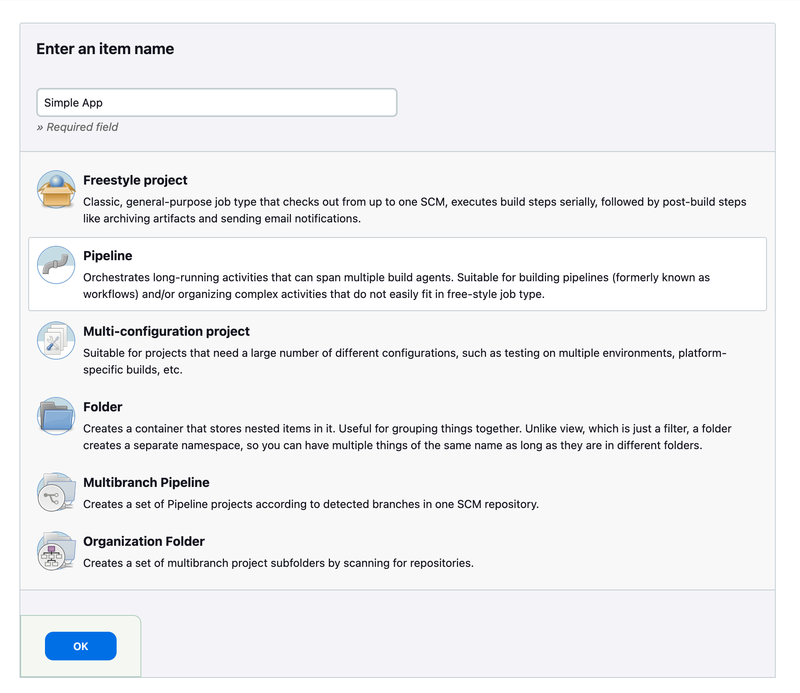</img></p>

Select the `GitHub Project` checkbox, and then fill in the GitHub project URL, e.g.,

```
https://github.com/stedrew/simple-python-pyinstaller-app
```

In the `Pipeline` Section, change the dropdown list value of `Definition` to `Pipeline Script from SCM`. Fill in the repository URL:

```
https://github.com/stedrew/simple-python-pyinstaller-app
```

<p align='center'>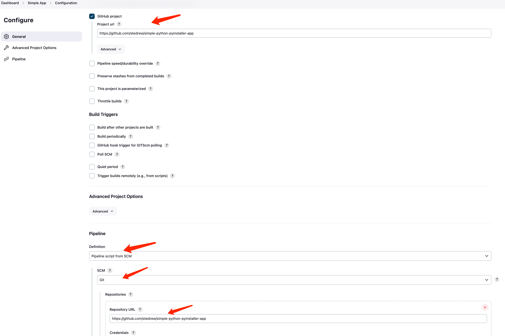</img></p>

Click `Save` to save the job configuration. Go to the `Dashboard`, you will be able to see the newly created `Simple App` project. Click into the project and on the left side, click `Build Now` to build the project.

<p align='center'>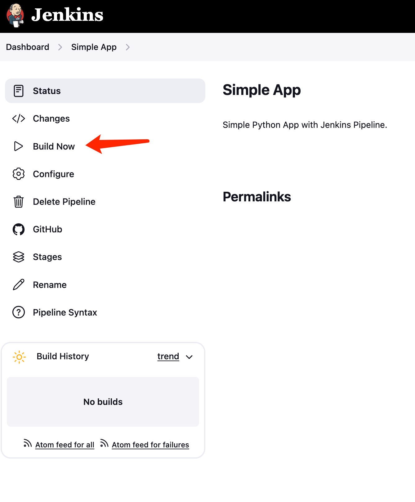</img></p>

You may click into the build history with the build number to see the details of the build, including the console output:

<p align='center'>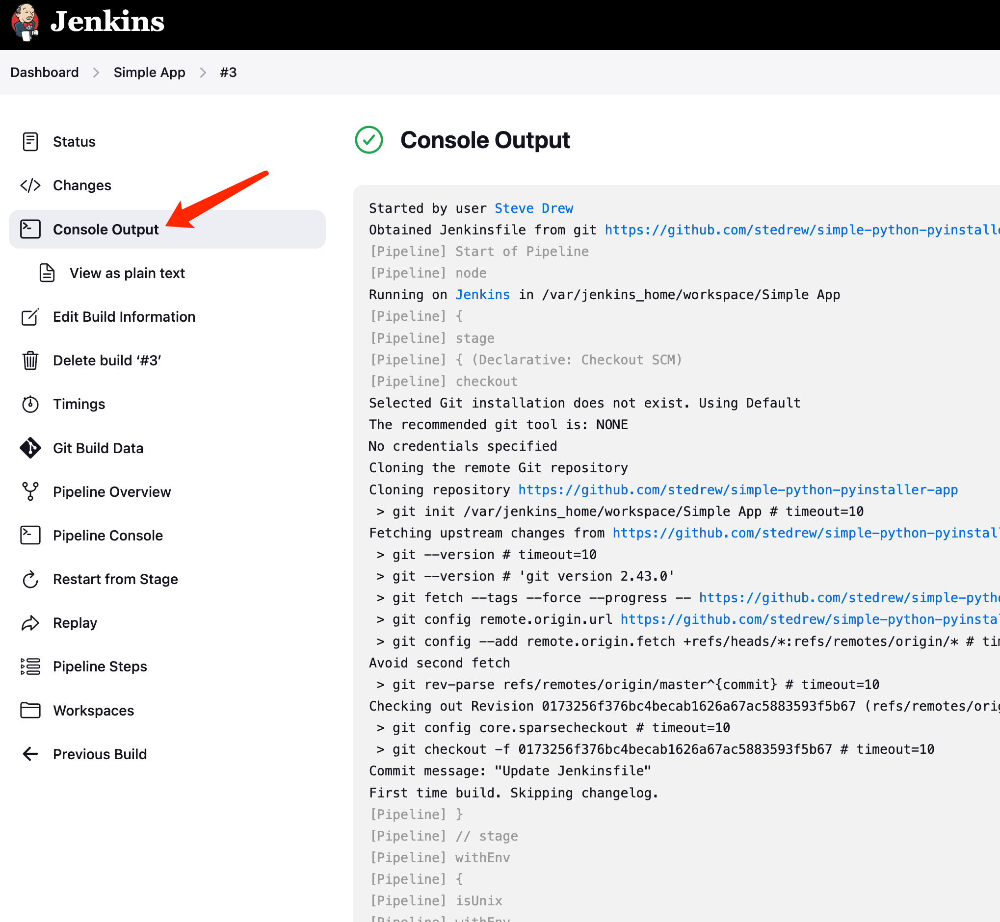</img></p>


## Add a test stage to your Pipeline

Go back to your text editor/IDE and ensure your `Jenkinsfile` is open.

Copy and paste the following Declarative Pipeline syntax immediately under the `Build` stage of your `Jenkinsfile`:

```groovy
stage('Test') {
    agent {
        docker {
            image 'qnib/pytest'
        }
    }
    steps {
        sh 'py.test --verbose --junit-xml test-reports/results.xml sources/test_calc.py'
    }
    post {
        always {
            junit 'test-reports/results.xml'
        }
    }
}
```

So that you end up with:

```groovy
pipeline {
    agent none
    stages {
        stage('Build') {
            agent {
                docker {
                    image 'python:2-alpine'
                }
            }
            steps {
                sh 'python -m py_compile sources/add2vals.py sources/calc.py'
            }
        }
        stage('Test') { //1
            agent {
                docker {
                    image 'qnib/pytest' //2
                }
            }
            steps {
                sh 'py.test --verbose --junit-xml test-reports/results.xml sources/test_calc.py' //3
            }
            post {
                always {
                    junit 'test-reports/results.xml' //4
                }
            }
        }
    }
}
```

Save your edited `Jenkinsfile` and commit it to your local `simple-python-pyinstaller-app` Git repository. E.g. Within the `simple-python-pyinstaller-app` directory, run the commands:
```
git commit -a -m "Add Test stage"
git push origin
```

Go back to Jenkins again and click `Build Now`. It may take a few minutes for the `qnib:pytest` Docker image to download (if this hasn’t already been done).

If your amended Pipeline ran successfully, here’s what the the interface should look like. Notice the additional "Test" stage. 

<p align='center'>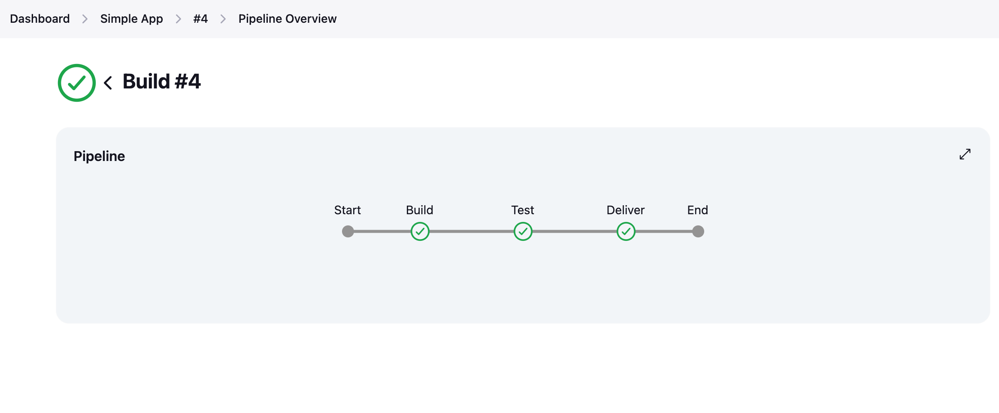</img></p>

Test report:
<p align='center'>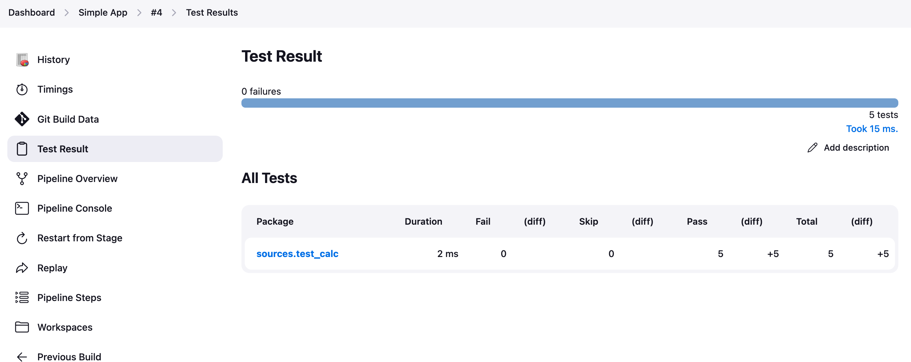</img></p>


## Add a final delivery stage to your Pipeline

Go back to your text editor/IDE and ensure your `Jenkinsfile` is open.

Copy and paste the following Declarative Pipeline syntax immediately under the `Test` stage of your `Jenkinsfile`:

```
stage('Deliver') {
    agent {
        docker {
            image 'cdrx/pyinstaller-linux:python2'
        }
    }
    steps {
        sh '/root/.pyenv/shims/pyinstaller --onefile sources/add2vals.py'
    }
    post {
        success {
            archiveArtifacts 'dist/add2vals'
        }
    }
}
```

Add a `skipStagesAfterUnstable` option so that you end up with:

```
pipeline {
    agent none
    options {
        skipStagesAfterUnstable()
    }
    stages {
        stage('Build') {
            agent {
                docker {
                    image 'python:2-alpine'
                }
            }
            steps {
                sh 'python -m py_compile sources/add2vals.py sources/calc.py'
            }
        }
        stage('Test') {
            agent {
                docker {
                    image 'qnib/pytest'
                }
            }
            steps {
                sh 'py.test --verbose --junit-xml test-reports/results.xml sources/test_calc.py'
            }
            post {
                always {
                    junit 'test-reports/results.xml'
                }
            }
        }
        stage('Deliver') { //1
            agent {
                docker {
                    image 'cdrx/pyinstaller-linux:python2' //2
                }
            }
            steps {
                sh '/root/.pyenv/shims/pyinstaller --onefile sources/add2vals.py' //3
            }
            post {
                success {
                    archiveArtifacts 'dist/add2vals' //4
                }
            }
        }
    }
}
```

Save your edited `Jenkinsfile` and commit it to your local `simple-python-pyinstaller-app` Git repository. E.g. Within the `simple-python-pyinstaller-app` directory, run the commands:

```
git commit -a -m "Add Deliver stage"
git push origin
```

Go back to Jenkins again and click `Build Now`.


### Follow up

If you use Linux, you can try running the standalone `add2vals` application you generated with PyInstaller locally on your machine. To do this:

1. From the main Jenkins interface, access your last Pipeline run you performed [above](https://jenkins.io/doc/tutorials/build-a-python-app-with-pyinstaller/#add-a-final-deliver-stage-to-your-pipeline). To do this, click the top row (representing the most recent Pipeline run) on the main Jenkins’s **Activity** page.

2. On the results page of the Pipeline run, click **Artifacts** at the top right to access the **Artifacts** page.

3. In the list of artifacts, click the down-arrow icon at the far right of the **dist/add2vals** artifact item to download the standalone executable file to your browser’s "Downloads" directory.

4. Back in your operating system’s terminal prompt, `cd` to your browser’s "Downloads" directory.

5. Make the `add2vals` file executable - i.e. `chmod a+x add2vals`

6. Run the command `./add2vals` and follow the instructions provided by your app.


## Get checked by lab TA

You’ve just used Jenkins to build a simple Python application.

Steps for TA examination:

* Functional `Build` stage
* Functional `Test` stage
* Functional `Deliver` stage

Each group member should be able to answer all of the following questions. The TA will ask each person one question selected at random, and the student must be able to answer the question to get credit for the lab.

- Q1: What is a `Jenkinsfile`, and where is it usually located? What does it do?
- Q2: What do stages and steps do? Can they be visualized? Show the TA an example.
- Q3: What is the use of the `agent` in each stage? Why are they using different docker images for different stages?
- Q4: What are artifacts in Jenkins usually used for?
